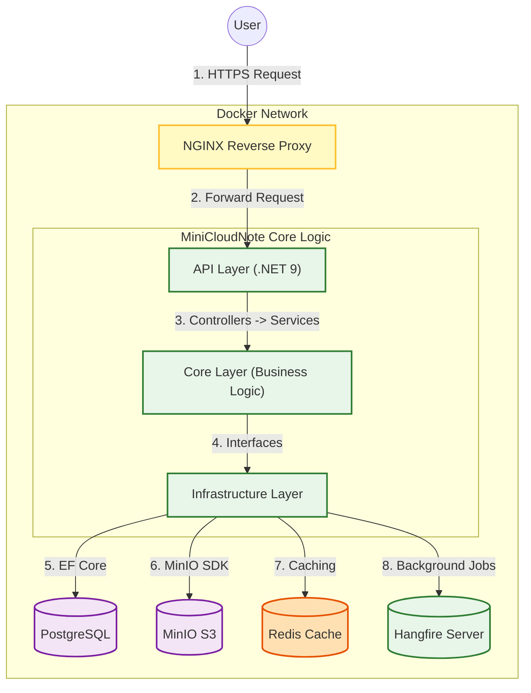
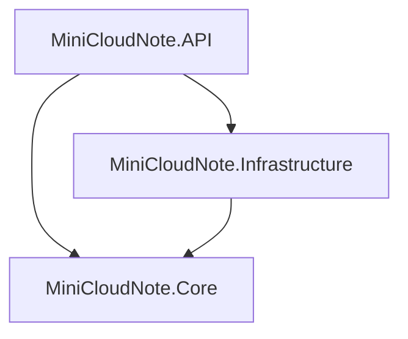

# Mini Cloud Note 📝


**Mini Cloud Note** is a scalable, secure, and production-ready backend system designed for personal knowledge management. It supports rich-text notes and file attachments (images, documents), built with strict adherence to **Software Engineering Principles** (SOLID, DRY) and **Clean Architecture**.

This repository represents a continuous journey of mastering modern Backend technologies, moving from a coding challenge to a fully deployable system with a comprehensive DevOps pipeline.

## 🚀 Project Overview

The goal is to simulate a real-world backend environment where high availability, security, and maintainability are priorities.

### Key Features
- **🔐 Advanced Authentication**: Secure Identity system using JWT (Access Token & Refresh Token strategies).
- **📝 Note Management**: Full CRUD operations for notes with Markdown support.
- **☁️ Object Storage**: Efficient file handling using MinIO (S3 compatible) for attachments.
- **⚡ High Performance**: Caching strategy implemented with **Redis**.
- **⏱️ Background Jobs**: Asynchronous task processing (email sending, file cleanup) using **Hangfire**.
- **🔍 Observability**: Centralized logging and monitoring via **Serilog** and **Seq**.
- **🐳 Containerization**: Full Docker support for "One-click" deployment.

## 🏗 System Architecture Diagram

The system follows **Clean Architecture** to ensure separation of concerns and testability.


## 🛠 Tech Stack

This project utilizes a modern, industry-standard technology stack:

- **Core Framework:** ASP.NET Core (.NET 9)
- **Database:** PostgreSQL (Relational Data)
- **ORM:** Entity Framework Core (Code-First Migration)
- **Storage:** MinIO (S3 Compatible Object Storage)
- **Caching:** Redis (Distributed Cache)
- **Background Jobs:** Hangfire
- **Logging:** Serilog + Seq
- **DevOps:** Docker, Docker Compose, Jenkins, NGINX
- **Testing:** xUnit (Planned), Postman/Swagger

## 📂 Project Structure

```text
MiniCloudNote/
├── src/
│   ├── MiniCloudNote.API/            # Entry Point, Controllers, DI Config
│   ├── MiniCloudNote.Core/           # Domain Entities, Interfaces, DTOs (Pure C#)
│   ├── MiniCloudNote.Infrastructure/ # DB Context, Repositories, External Services
├── tests/                            # Unit and Integration Tests
├── docker-compose.yml                # Orchestration for App + DB + Redis + MinIO + Seq
└── nginx/                            # Reverse Proxy Configuration
```

## 🧹 Clean Architecture


## ⚡ Getting Started

Follow these steps to get **MiniCloudNote** running on your local machine.

### Prerequisites

Ensure you have the following installed:
- **[Docker Desktop](https://www.docker.com/products/docker-desktop)** (Essential for running the full stack).
- **[.NET 9.0 SDK](https://dotnet.microsoft.com/download/dotnet/9.0)** (Optional, if you want to run/debug code locally without Docker).
- **[Git](https://git-scm.com/)**.

### Installation

1. **Clone the repository**

   ```bash
   git clone https://github.com/PHThai254/MiniCloudNote.git
   cd MiniCloudNote
    ```

2. **Configure Environment:** 
Since sensitive configuration files are not committed, you need to set up your `appsettings.json`.
    * Create a file named `appsettings.json` in `src/MiniCloudNote.API/`
    * (Optional) Update the connection strings if you are not using the default Docker setup.

3. **Run with Docker Compose (Recommended):** 
This command will spin up the API, PostgreSQL, Redis, MinIO, and Seq automatically.
    ```bash
    docker-compose up -d --build
    ```

4. **Verify Deployment:** Check if all containers are up and healthy:

    ```bash
    docker ps
    ```

5. **Access the Application:**
    * **Swagger API Docs:** `http://localhost:5265/swagger`
    * **MinIO Console:** `http://localhost:9001`
    * **Seq Logs:** `http://localhost:5341`
    * **Hangfire Dashboard:** `http://localhost:5265/hangfire`


