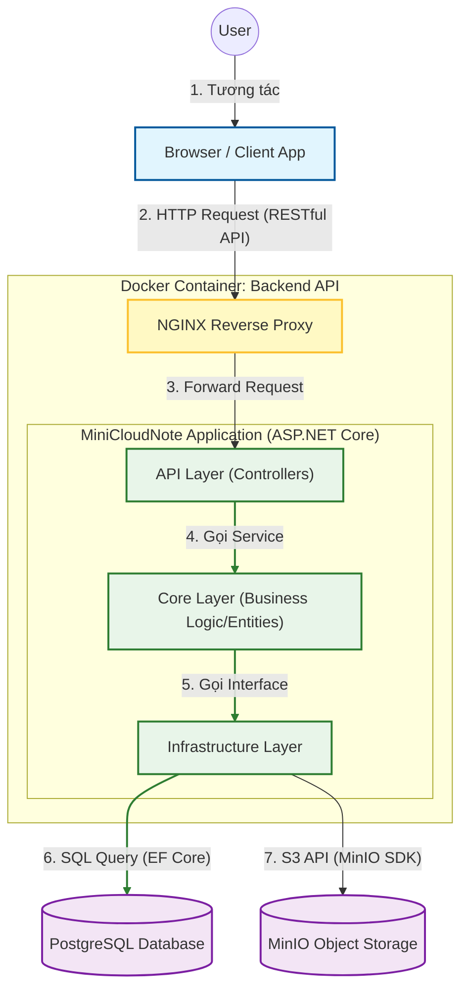

# Mini Cloud Note 📝

**Mini Cloud Note** is a comprehensive backend system for a personal note-taking application that supports file attachments (images, documents). This project is built to demonstrate strict adherence to software engineering principles, including SOLID, Clean Architecture, and a full DevOps pipeline.

This repository tracks my journey of mastering modern technologies over a **42-day coding challenge**.

## 🚀 Project Overview

The goal is to build a scalable, secure, and deployable backend system where users can:
- Securely register and login (JWT Authentication).
- Manage personal notes (Create, Read, Update, Delete).
- Upload and manage attachments using Object Storage (MinIO).

## MiniCloudNote System Architecture Diagram


## 🛠 Tech Stack

This project utilizes a modern, industry-standard technology stack:

- **Core Framework:** ASP.NET Core (.NET 9)
- **Database:** PostgreSQL
- **Object Storage:** MinIO (S3 Compatible) for file storage
- **Architecture:** Clean Architecture & Layered Architecture
- **Containerization:** Docker & Docker Compose
- **CI/CD:** Jenkins & GitHub Webhooks
- **Gateway/Proxy:** NGINX
- **Tunneling:** Ngrok (for public exposure)

## 📂 Project Structure

```text
MiniCloudNote/
├── src/
│   ├── MiniCloudNote.API/    # Main Entry Point (Web API)
│   ├── MiniCloudNote.Core/   # Domain Entities & Interfaces (Planned)
│   ├── MiniCloudNote.Infrastructure/  # Database & External Services (Planned)
└── docker-compose.yml        # Container Orchestration