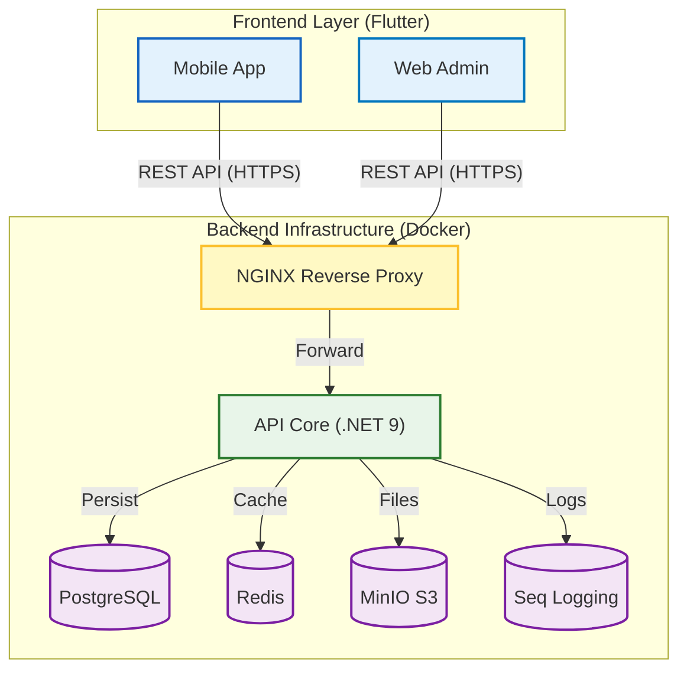
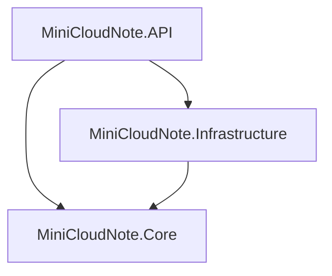

# Mini Cloud Note 📝


**Mini Cloud Note** is a comprehensive, cross-platform personal knowledge management system. It features a robust **.NET Backend** following Clean Architecture and a responsive **Flutter Frontend** (Mobile & Web) using the BLoC pattern.

This repository is organized as a **Monorepo**, representing a continuous journey of mastering full-stack software engineering, from low-level backend optimization to high-level UI/UX state management.

## 🚀 Project Overview

The goal is to build a production-ready system that seamlessly syncs notes across devices while maintaining strict security and high performance.

🌟 **Key Features**

🛡️ **Backend (.NET Core)**
- **🔐 Advanced Authentication**: Secure Identity system using JWT (Access Token & Refresh Token strategies).
- **📝 Note Management**: Full CRUD operations for notes with Markdown support.
- **☁️ Object Storage**: Efficient file handling using MinIO (S3 compatible) for attachments.
- **⚡ High Performance**: Caching strategy implemented with **Redis**.
- **⏱️ Background Jobs**: Asynchronous task processing (email sending, file cleanup) using **Hangfire**.
- **🔍 Observability**: Centralized logging and monitoring via **Serilog** and **Seq**.
- **🐳 Containerization**: Full Docker support for "One-click" deployment.

📱**Frontend (Flutter)**
- **Cross-Platform**: Single codebase running on **Android, iOS, and Web.**
- **State Management**: Predictable state management using **BLoC (Business Logic Component).**
- **Networking**: Robust API handling with **Dio** and Interceptors.
- **Responsive UI**: Adaptive design for both mobile screens and web dashboards.

## 🏗 System Architecture Diagram

The system operates on a client-server model within a containerized environment.


## 🛠 Tech Stack

This project utilizes a modern, industry-standard technology stack:

- **Backend:** ASP.NET Core 9, Entity Framework Core, Hangfire
- **Frontend:** Flutter (Dart), BLoC, Dio, Equatable
- **Database:** PostgreSQL (Relational), Redis (Cache)
- **Storage:** MinIO (S3 Compatible Object Storage)
- **DevOps:** Docker, Docker Compose, Jenkins, NGINX
- **Tools:** Visual Studio 2022, VS Code, Postman, Android Studio

## 📂 Project Structure

```text
MiniCloudNote/
├── backend/                  # .NET Core API Solution
│   ├── src/
│   │   ├── MiniCloudNote.API/            # Entry Point
│   │   ├── MiniCloudNote.Core/           # Domain & Logic
│   │   └── MiniCloudNote.Infrastructure/ # DB & External Services
│   ├── Dockerfile
│   └── MiniCloudNote.sln
│
├── frontend/                 # Flutter Application
│   ├── android/              # Android native code
│   ├── ios/                  # iOS native code
│   ├── lib/                  # Dart source code (Screens, BLoCs)
│   └── pubspec.yaml
│
├── docker-compose.prod.yml   # Production Orchestration
├── nginx/                    # Reverse Proxy Config
└── .github/                  # CI/CD Workflows
```

## 🧹 Clean Architecture


## ⚡ Getting Started

Follow these steps to get **MiniCloudNote** running on your local machine.

### Prerequisites

Ensure you have the following installed:
- **[Docker Desktop](https://www.docker.com/products/docker-desktop)** (Required for Backend).
- **[Flutter SDK](https://docs.flutter.dev/install)** (Required for Frontend).

1. **Setup Backend (Docker)**

   ```bash
    # 1. Navigate to root
    cd MiniCloudNote

    # 2. Start Backend Infrastructure
    docker-compose -f docker-compose.prod.yml up -d --build
    ```
    Wait a few minutes for the containers to initialize.

2. **Setup Frontend (Flutter)** 
Open a new terminal to run the mobile/web app.
    
    ```bash
    # 1. Navigate to frontend folder
    cd frontend

    # 2. Get Dependencies
    flutter pub get

    # 3. Run the App
    flutter run
    ```

3. **Access the Application:**
    * **API Swagger:** `http://localhost:5265/swagger`
    * **MinIO Console:** `http://localhost:9001`
    * **Seq Logs:** `http://localhost:5341`
    * **Hangfire Dashboard:** `http://localhost:5265/hangfire`

    ---
    **Author:** PHAM HONG THAI
    ---


