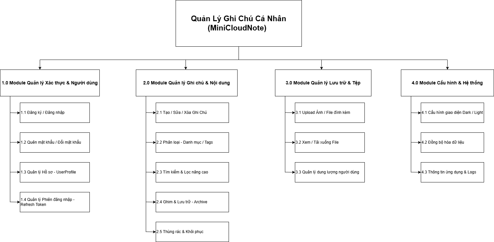

# Sơ đồ phân rã chức năng

## 1. Tổng quan
Tài liệu này mô tả cấu trúc chức năng của hệ thống **MiniCloudNote** (Ứng dụng Ghi chú Cá nhân). Hệ thống được chia thành 4 phân hệ (module) chính để đảm bảo tính tách biệt nghiệp vụ (Separation of Concerns), giúp dễ dàng bảo trì và mở rộng tính năng mà không ảnh hưởng lẫn nhau.

## 2. Sơ đồ Minh họa
*(Bấm vào ảnh để xem kích thước đầy đủ)*

## 3. Chi tiết các Module

### 3.1. Module Quản lý Xác thực & Người dùng (Identity Module)
Đây là cổng vào của hệ thống, chịu trách nhiệm bảo mật và định danh người dùng.
* **Chức năng chính:**
    * **Đăng ký / Đăng nhập:** Hỗ trợ xác thực bảo mật bằng JWT (Access Token & Refresh Token).
    * **Quản lý Hồ sơ (UserProfile):** Lưu trữ thông tin cá nhân (Tên, Avatar, Bio) tách biệt với tài khoản đăng nhập để tối ưu hiệu năng truy vấn.
    * **Quản lý Phiên:** Cơ chế tự động làm mới token (Silent Refresh) giúp trải nghiệm người dùng không bị gián đoạn.
    * **Bảo mật:** Đổi mật khẩu, Quên mật khẩu (gửi email xác nhận).

### 3.2. Module Quản lý Ghi chú (Core Domain)
Đây là module trung tâm, chứa nghiệp vụ cốt lõi của ứng dụng.
* **Chức năng chính:**
    * **CRUD:** Tạo mới, Đọc, Chỉnh sửa, và Xóa ghi chú.
    * **Tổ chức thông tin:** Phân loại ghi chú bằng Danh mục (Category) hoặc gắn Thẻ (Tags) để dễ dàng quản lý.
    * **Vòng đời ghi chú:**
        * *Active:* Ghi chú đang hoạt động (hiển thị ở màn hình chính).
        * *Archived:* Ghi chú lưu trữ (ẩn đi cho gọn nhưng vẫn tìm kiếm được).
        * *Trash:* Thùng rác (nơi chứa ghi chú đã xóa, có thể khôi phục hoặc xóa vĩnh viễn).
    * **Tìm kiếm:** Hỗ trợ tìm kiếm nâng cao theo tiêu đề, nội dung và bộ lọc (filter).

### 3.3. Module Quản lý Lưu trữ (Storage Module)
Module này được tách riêng để xử lý các file Binary (Ảnh, Tài liệu đính kèm), giúp giảm tải cho Database chính.
* **Công nghệ:** Sử dụng **MinIO** (S3 Compatible Object Storage).
* **Quy trình:**
    * Client upload file -> Server kiểm tra (validate) -> Server lưu vào MinIO -> Server lưu URL truy cập vào Database.
* **Chức năng:**
    * Upload ảnh/file đính kèm vào ghi chú.
    * Xem và tải xuống file.
    * Quản lý dung lượng sử dụng của người dùng (Quota).

### 3.4. Module Cấu hình & Hệ thống (Settings)
Quản lý các thiết lập cá nhân hóa và tiện ích nền tảng.
* **Cá nhân hóa:** Tùy chỉnh giao diện Sáng/Tối (Dark Mode) và ngôn ngữ.
* **Đồng bộ:** Cơ chế đồng bộ dữ liệu (Sync) giữa các thiết bị (Mobile & Web).
* **Thông tin:** Hiển thị thông tin phiên bản ứng dụng, gửi báo cáo lỗi (Crash Reporting) về server.

## 4. Ghi chú Kỹ thuật (Technical Notes)
* **Kiến trúc:** Áp dụng **Clean Architecture** để phân tách rõ ràng giữa logic nghiệp vụ và hạ tầng kỹ thuật.
* **Database:** * **PostgreSQL:** Lưu trữ dữ liệu có cấu trúc (User, Note, Metadata).
    * **Redis:** Cache dữ liệu thường xuyên truy cập để tăng tốc độ.
* **File Storage:** **MinIO** cho lưu trữ file đính kèm.
* **Frontend:** **Flutter** sử dụng **BLoC Pattern** để quản lý trạng thái.