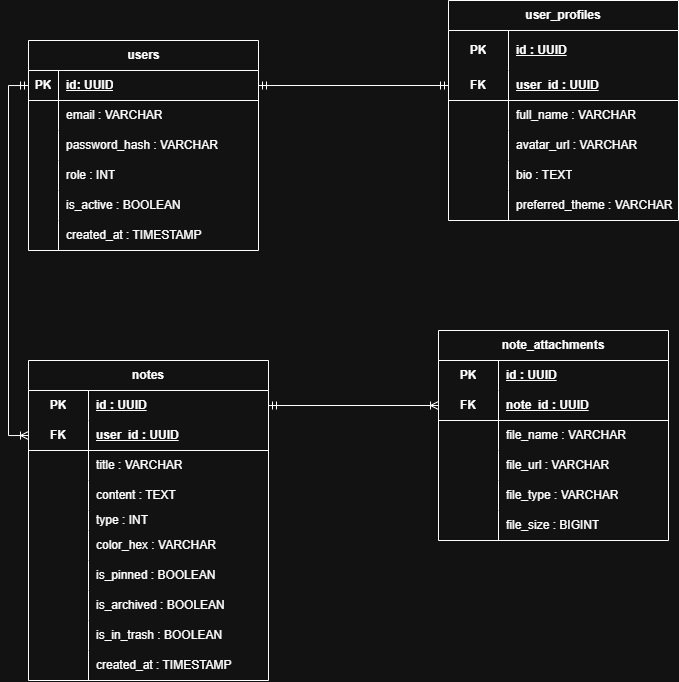

# Sơ đồ Thực thể - Liên kết (ERD) - Database Design

## 1. Tổng quan Database
Tài liệu này mô tả cấu trúc Cơ sở dữ liệu quan hệ (RDBMS) của hệ thống MiniCloudNote. Hệ thống sử dụng **PostgreSQL** làm cơ sở dữ liệu chính. Sơ đồ ERD thể hiện các bảng (tables), các cột dữ liệu (columns), và các khóa liên kết (PK, FK) giữa chúng.

## 2. Sơ đồ ERD Minh họa
*(Bấm vào ảnh để xem kích thước đầy đủ)*

## 3. Cấu trúc Các Bảng (Tables)

### 3.1. Bảng `users` (Tài khoản)
* **Mục đích:** Lưu trữ thông tin định danh và phục vụ cho module xác thực (Authentication).
* **Khóa chính (PK):** `id` (UUID).
* **Ghi chú:** Mật khẩu được băm (hash) bảo mật trước khi lưu vào cột `password_hash`.

### 3.2. Bảng `user_profiles` (Hồ sơ người dùng)
* **Mục đích:** Chứa các thông tin cá nhân mở rộng, tách biệt khỏi bảng `users` để tối ưu hóa truy vấn đăng nhập.
* **Khóa chính (PK):** `id` (UUID).
* **Khóa ngoại (FK):** `user_id` tham chiếu đến `users.id`.
* **Ràng buộc:** Cột `user_id` phải là UNIQUE để đảm bảo quan hệ **1-1** (Mỗi user chỉ có 1 profile).

### 3.3. Bảng `notes` (Ghi chú)
* **Mục đích:** Lưu trữ nội dung chính yếu của hệ thống - các ghi chú của người dùng.
* **Khóa chính (PK):** `id` (UUID).
* **Khóa ngoại (FK):** `user_id` tham chiếu đến `users.id` (Quan hệ **1-N**).
* **Ghi chú:** Các trạng thái vòng đời của ghi chú được kiểm soát qua các cờ boolean: `is_pinned`, `is_archived`, `is_in_trash`.

### 3.4. Bảng `note_attachments` (Tệp đính kèm)
* **Mục đích:** Quản lý metadata của các tệp (hình ảnh, tài liệu) được đính kèm vào trong từng ghi chú.
* **Khóa chính (PK):** `id` (UUID).
* **Khóa ngoại (FK):** `note_id` tham chiếu đến `notes.id` (Quan hệ **1-N**).
* **Ghi chú:** File vật lý không lưu trong Database. Cột `file_url` lưu trữ đường dẫn trỏ tới Object Storage (MinIO).

## 4. Các Quy ước Thiết kế (Database Conventions)
* **Naming:** Tất cả tên bảng và tên cột đều viết thường theo chuẩn `snake_case` (ví dụ: `user_profiles`, `created_at`).
* **ID:** Sử dụng `UUID` (GUID) cho khóa chính thay vì Auto-increment Integer để tăng tính bảo mật và dễ dàng mở rộng khi chia nhỏ Database (Sharding) sau này.
* **Xóa dữ liệu:** Hệ thống ưu tiên Xóa mềm (Soft Delete).