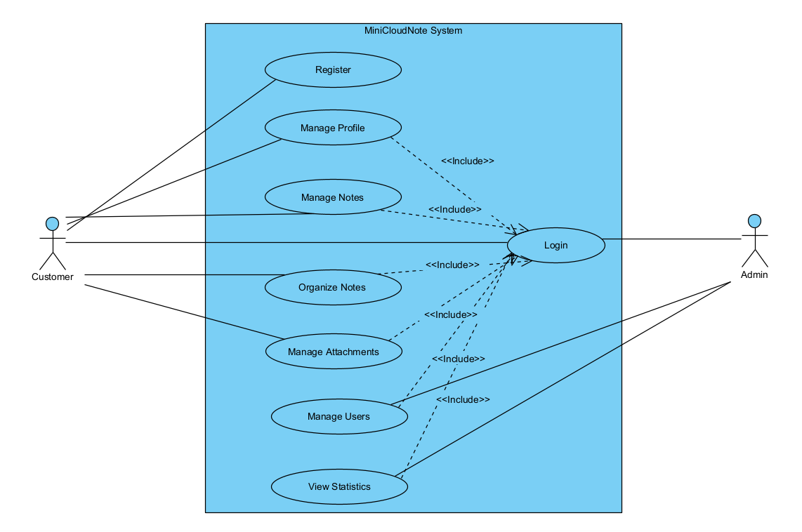

# Sơ đồ Use Case (Ca sử dụng) - System Behavior

## 1. Tổng quan Hành vi Hệ thống
Tài liệu này mô tả Sơ đồ Use Case của hệ thống **MiniCloudNote**, tập trung vào việc định nghĩa các Tác nhân (Actors) tham gia vào hệ thống và các chức năng (Use Cases) mà họ có quyền thực hiện. Sơ đồ giúp xác định rõ ranh giới hệ thống và phân quyền cơ bản.

## 2. Sơ đồ Minh họa
*(Bấm vào ảnh để xem kích thước đầy đủ)*

## 3. Phân tích Tác nhân (Actors)
Hệ thống có 2 nhóm người dùng chính đứng ngoài đường biên hệ thống (System Boundary):
* **Customer (Khách hàng/Người dùng cá nhân):** Là người sử dụng cốt lõi của ứng dụng. Họ tương tác với hệ thống để ghi chép, lưu trữ và tổ chức thông tin cá nhân.
* **Admin (Quản trị viên):** Là người vận hành hệ thống, có quyền hạn cao nhất để theo dõi sức khỏe ứng dụng và quản lý các tài khoản khách hàng.

## 4. Chi tiết các Ca sử dụng (Use Cases)

### 4.1. Nhóm Xác thực (Authentication)
* **`Đăng ký`**: Khách hàng tạo tài khoản mới bằng Email và Mật khẩu.
* **`Đăng nhập`**: Use Case trọng tâm. Tất cả các tính năng nghiệp vụ khác đều chứa mối quan hệ `<<include>>` tới `Đăng nhập`, nghĩa là người dùng bắt buộc phải xác thực thành công mới được phép sử dụng.

### 4.2. Nhóm Tính năng Khách hàng (Customer)
* **`Quản lý Hồ sơ`**: Cho phép Customer cập nhật thông tin cá nhân (Tên, Tiểu sử, Avatar) và cài đặt giao diện (Sáng/Tối).
* **`Quản lý Ghi chú`**: Bao gồm các thao tác CRUD cơ bản (Tạo, Đọc, Sửa, Xóa) trên một ghi chú.
* **`Tổ chức Ghi chú`**: Các hành vi phân loại nâng cao như Ghim (Pin), Lưu trữ (Archive), hoặc Chuyển vào thùng rác (Trash).
* **`Quản lý Tệp đính kèm`**: Tải lên (Upload) hình ảnh hoặc tài liệu vào nội dung ghi chú.

### 4.3. Nhóm Tính năng Quản trị (Admin)
* **`Quản lý Người dùng`**: Xem danh sách các tài khoản Customer hiện có, thực hiện Khóa (Deactivate) hoặc Mở khóa tài khoản khi có vi phạm.
* **`Xem Thống kê`**: Xem các báo cáo hệ thống như tổng số người dùng, tổng dung lượng file đang lưu trữ để có kế hoạch nâng cấp Server (MinIO/PostgreSQL).