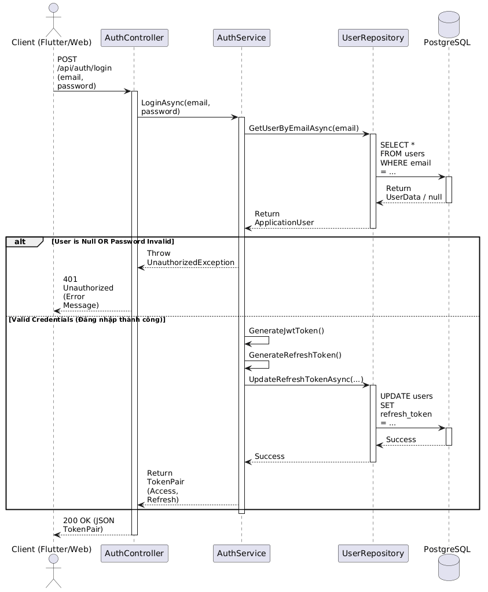

# Sơ đồ Tuần tự (Sequence Diagram)

## 1. Tổng quan
Tài liệu này mô tả Sơ đồ Tuần tự (Sequence Diagram) cho các luồng nghiệp vụ cốt lõi trong hệ thống MiniCloudNote. Sơ đồ thể hiện rõ sự tương tác giữa các thành phần theo kiến trúc **Clean Architecture** (Controller -> Service -> Repository -> Database).

## 2. Luồng Đăng nhập và Cấp phát Token (Login & JWT Generation)
*(Bấm vào ảnh để xem kích thước đầy đủ)*

### 2.1. Phân tích chi tiết luồng
1. **Client** gửi yêu cầu `POST` chứa thông tin đăng nhập (`email`, `password`) tới `AuthController`.
2. Controller làm nhiệm vụ tiếp nhận, gọi xuống tầng `AuthService` để xử lý logic nghiệp vụ.
3. `AuthService` yêu cầu `UserRepository` truy vấn Database để tìm người dùng theo Email.
4. Hệ thống kiểm tra điều kiện (Alt Block):
   * **Thất bại:** Nếu email không tồn tại hoặc mật khẩu không khớp mã Hash, trả về lỗi `401 Unauthorized`.
   * **Thành công:** Tự động tạo `AccessToken` (JWT) và `RefreshToken`.
5. `AuthService` lưu `RefreshToken` mới vào Database (thông qua Repository) để phục vụ việc cấp lại token sau này.
6. Kết quả cuối cùng trả về cho Client là bộ Token (Access & Refresh) với HTTP Status `200 OK`.