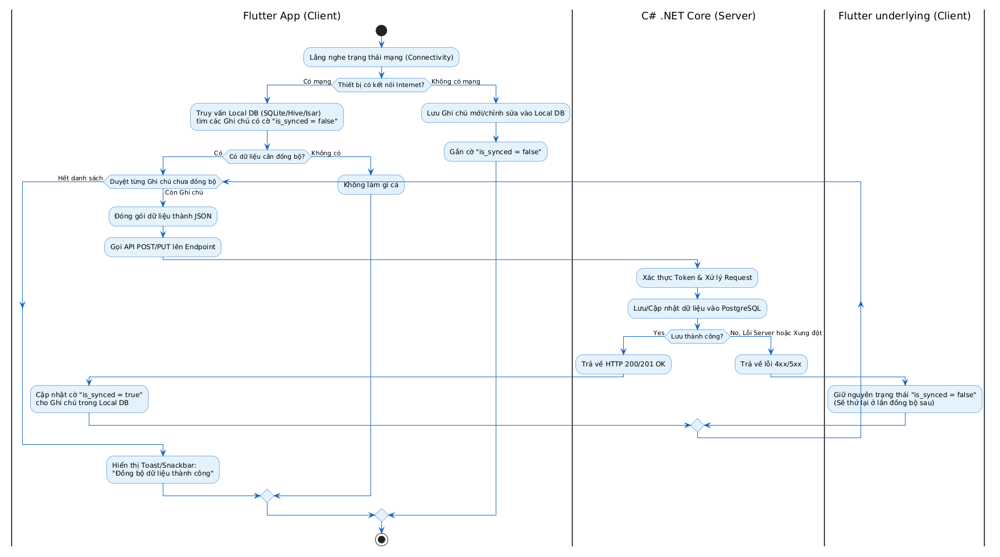

# Sơ đồ Hoạt động (Activity Diagram)

## 1. Tổng quan
Sơ đồ Hoạt động này mô tả chi tiết thuật toán **Đồng bộ hóa dữ liệu (Offline-to-Online Synchronization)**. Đây là tính năng cốt lõi giúp nâng cao trải nghiệm người dùng (UX) trên ứng dụng di động, đảm bảo dữ liệu ghi chú không bị mất khi thao tác trong môi trường không có kết nối Internet.

## 2. Luồng Đồng bộ hóa (Sync Flow)
*(Bấm vào ảnh để xem kích thước đầy đủ)*

## 3. Phân tích Thuật toán
1. **Cơ chế Local-First:** Mọi thao tác tạo/sửa/xóa ghi chú của người dùng đều được lưu ngay lập tức xuống cơ sở dữ liệu cục bộ (Local DB) trên thiết bị di động với một cờ trạng thái `is_synced = false`.
2. **Kích hoạt đồng bộ (Trigger):** Quá trình đồng bộ được kích hoạt ngầm khi thiết bị nhận diện có kết nối Internet trở lại, hoặc khi người dùng thực hiện thao tác Pull-to-Refresh.
3. **Xử lý trên Server (.NET Core):** Server tiếp nhận dữ liệu, xử lý các logic nghiệp vụ (như kiểm tra quyền, validate dữ liệu) và cập nhật vào Database chính (PostgreSQL).
4. **Cập nhật trạng thái:** Chỉ khi Server trả về mã HTTP 2xx (Thành công), App mới cập nhật lại cờ `is_synced = true` dưới Local DB, kết thúc một vòng đời đồng bộ an toàn.